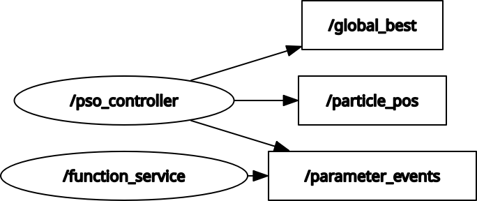
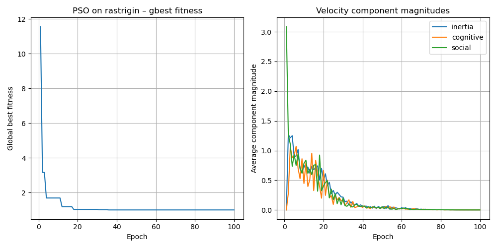
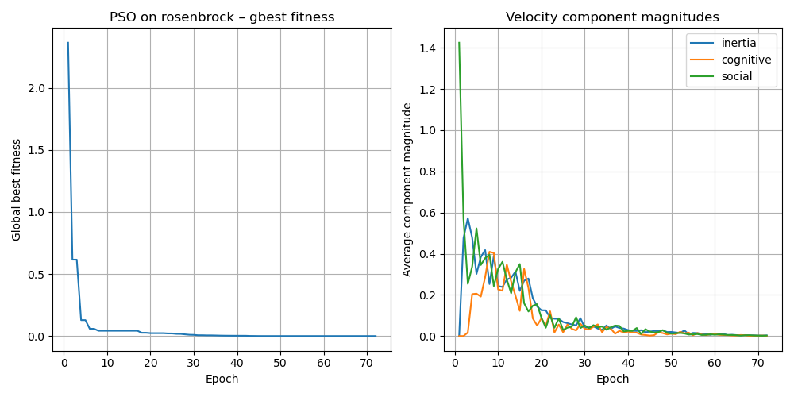
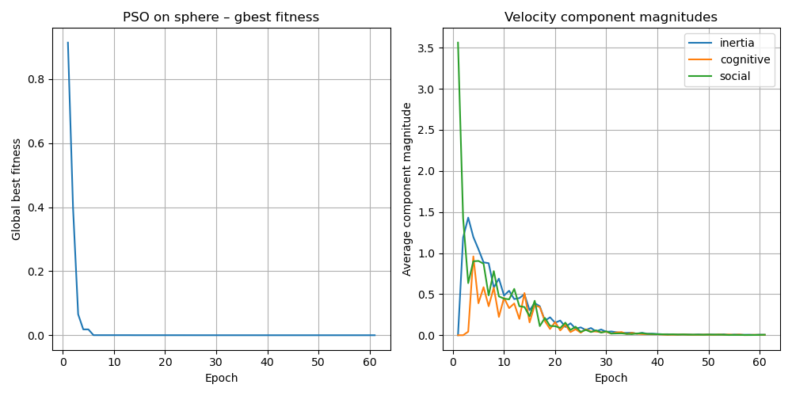

# Particle Swarm Optimization (PSO) in ROS 2
**Author:** Joseph Pokuta
**Course:** Robot Operating Systems | Michigan Technological University
Utilizes ROS to create a distributed swarm intelligence system for minimizing benchmark functions.

## Overview
This project implements a Particle Swarm Optimization (PSO) algorithm using ROS 2 Jazzy. The system navigates complex 3D benchmark functions to find global minima by collectively moving simulated particles.
The system uses a service-based architecture to separate the mathematical evaluation of the environment from the optimization logic, enabling modular testing of different units under test (UUTs).

## System Architecture
The swarm is coordinated with two primary ROS nodes:
* `/function_service`: Acts as the environment, providing an `Evaluate2D` service that computes the fitness value for a given (x,y) coordinate based on the chosen benchmark function.
* `/pso_controller`: The brain of the swarm, managing particle states (position, velocity, personal bests), computing velocity updates and handling communication with the function service.

<div align="center">
  
  <br>
  <sup><strong>System Topology:</strong> Relationship between the <code>/pso_controller</code>, the <code>/function_service</code>, and the resulting telemetry topics.</sup>
</div>

## Optimization Functions
This system was tested against three optimization benchmarks:
1. **Sphere Function**: A smooth, convex surface
2. **Rosenbrock Function**: A narrow, steep-walled valley to test how the swarm slides toward a minimum
3. **Rastrigin Function**: Highly non-convex, with many local minima to test the swarm's ability to avoid premature convergence

## Technical Implementation

### Swarm Dynamics
Each particle is governed by the standard PSO velocity update equation:
$$v_{i}(t+1) = w v_{i}(t) + c_1 r_1 (pbest_{i} - x_{i}(t)) + c_2 r_2 (gbest - x_{i}(t))$$

Where:
* $v_{i}(t)$: Current velocity of particle $i$.
* $w$: Inertia weight (set to `0.7`).
* $c_1, c_2$: Cognitive and social acceleration coefficients (set to `1.4`).
* $r_1, r_2$: Random values sampled uniformly from $[0, 1]$.

### Interface
The project uses a custom interface package `pso_interfaces` for defining a service that coordinates evaluation. This allows the controller to remain independent of the specific function minimized.

## Anaylsis
Each benchmark was tested with a swarm size of 10 over 100 epochs. The plots below compare the **Global Best Fitness** (left) against the **Velocity Component Magnitudes** (right), illustrating the balance between inertia, cognitive, and social pulls.

### Rastrigin Function
*Demonstrates the swarm getting trapped in local minima due to the rough landscape and small swarm size.*
<div align="center">
  
</div>

### Rosenbrock Function
*Shows the "velocity burst" characteristic of the swarm navigating the steep valley walls.*
<div align="center">
  
</div>

### Sphere Function
*The baseline for ideal convergence; shows the smoothest decay in velocity components.*
<div align="center">
  
</div>

## Project Structure
* `pso_ws/src/pso_interfaces`: Custom ROS 2 `srv` definitions for coordinate evaluation
* `pso_ws/src/pso_nodes`: Python implementation of the controller and function service
* `Images/`: Convergence plots and RQT graph visualizations

## How to Run
1. Source your ROS 2 Jazzy environment.
2. Build the workspace:
```
colcon build --packages-select pso_interfaces pso_nodes
source install/setup.bash
```
3. Launch the function service and controller
